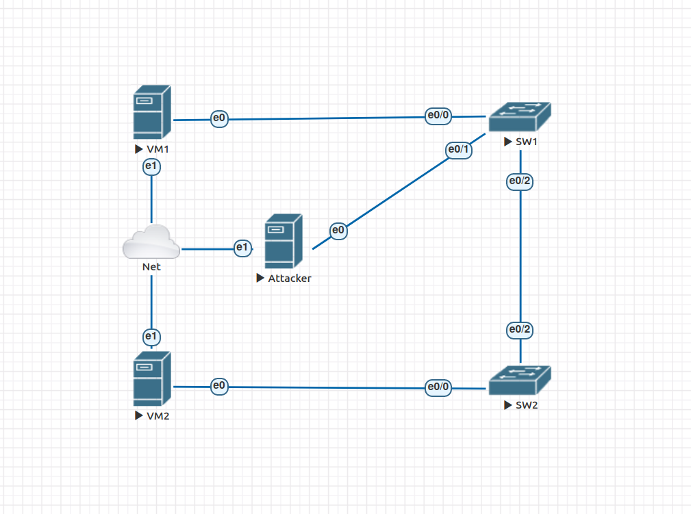
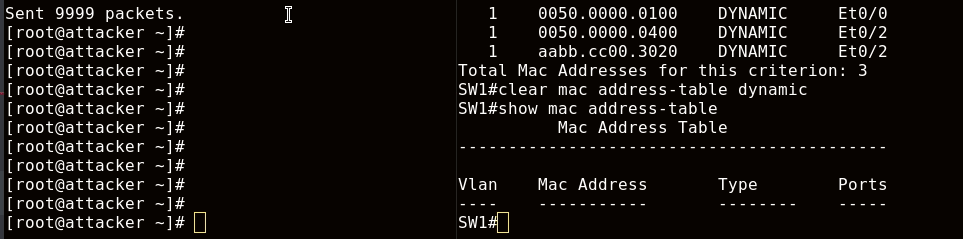
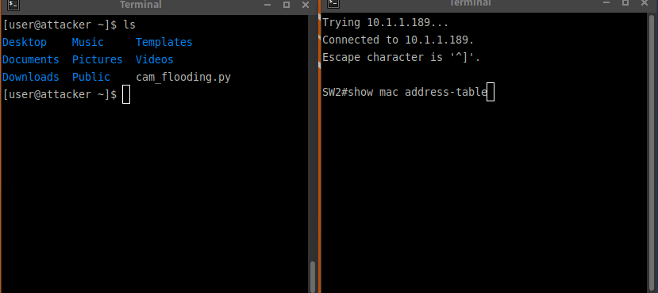
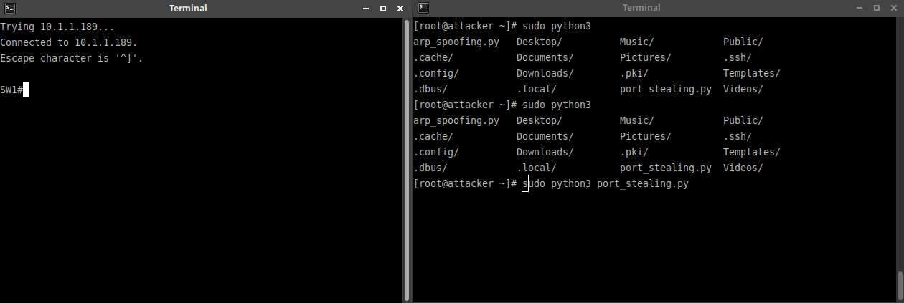
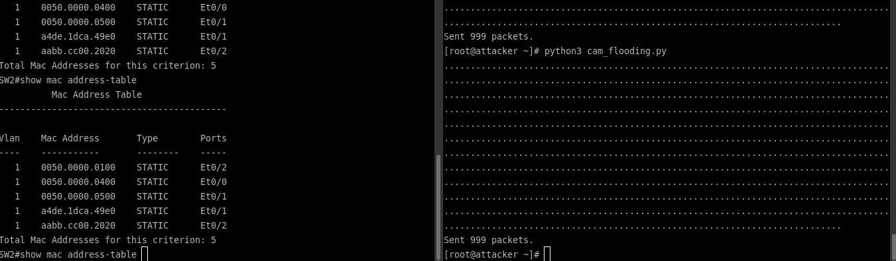
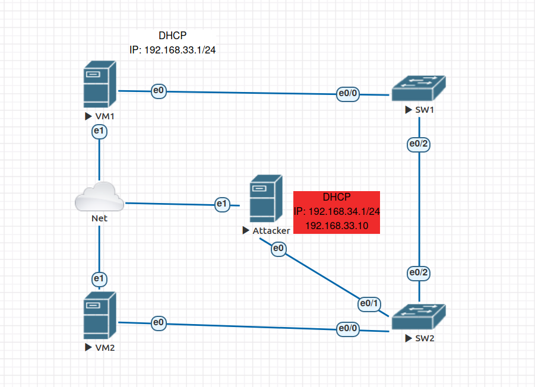
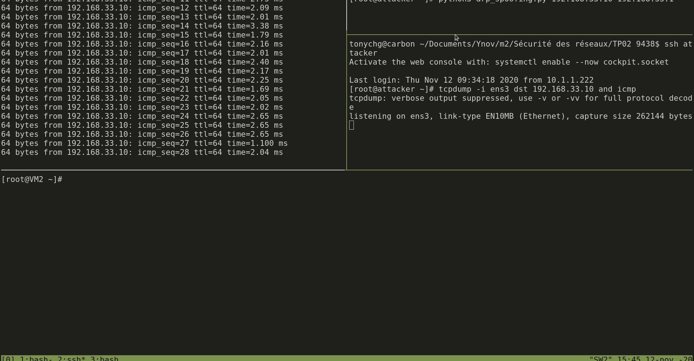
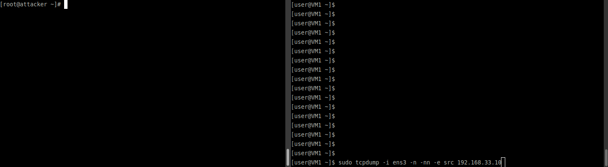
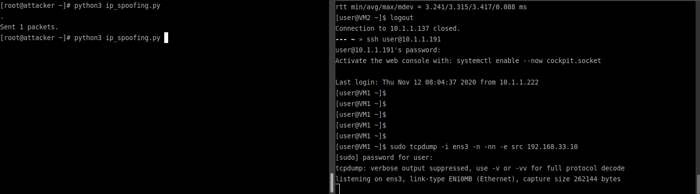

# Mise en œuvre des fonctionnalités de sécurité réseau d'un switch

[[_TOC_]]

## Todos

* Configuration de deux serveurs DHCP (Légitime, Pirate)
    * [x] (A) Serveur légitime
    * [x] (A) Serveur attaquant
* 4 scénarios d'attaques
    * [X] (G) CAM Flooding (script Python)
    * [x] (A) DHCP Snooping
    * [X] (B) Port Stealing (script Python)
    * [x] ARP Spoofing (script Python)
    * [X] (G) IP Spoffing (script Python)
* 3 mise en place de protection
    * [X] (G,B) Port security
    * [x] (A) DHCP Snooping
    * [X] Dynamic ARP inspection
    * [X] (G) IP Source Guard
* Pour chaque scénarios
    * [ ] Difficulté de mise en place
    * [X] Description
    * [X] GIF et vérifications
* Notes
    * [X] commandes utiles

## Tableau d'addressage

| Name     | IP            | Gateway      | Description |
|----------|---------------|--------------|-------------|
| VM1      | 192.168.33.1  | -            | Gateway     |
| VM2      | 192.168.33.10 | 192.168.33.1 | Victime     |
| Attacker | 192.168.33.11 | 192.168.33.1 | Attaquant   |

## Schéma d'infrastructure



## 3.1 CAM Flooding, port-stealing et mise en œuvre de contre-mesures

### Rappels théoriques

#### Table CAM (Content Addressable Memory)

Table de référence d'un Switch qui fait la relation entre une adresse MAC et un numéro de port. Cette table contient également les paramètres VLAN associés.

#### CAM Flooding Attack / Attaque par saturation

L'attaque exploite les limitations matérielles et de mémoire de la table CAM du Switch. Elle consiste à envoyer de (très) nombreuses trames Ethernet au Switch. Chaque trame envoyée possède une adresse MAC source différente (généralement erronnée), dans le but de remplir l'intégralité de l'espace disponible de la table CAM.

Une fois la table remplie, le trafic réseau est flood sur tous les ports car étant donné que la table CAM ne peut plus stocker d'adresses MAC, elle n'est plus en mesure de déterminer quelle adresse MAC de destination correspond à quel paquet envoyé. Le Switch agit alors comme un Hub.

#### Port stealing Attack / Attaque par vol de port 

L'attaquant utilise l'adresse MAC de la victime pour garnir la table CAM du Switch avec le couple :
- Adresse MAC de la Victime
- Port de la machine de l'attaquant

Ainsi l'attaquant recevra tous les paquets destinés à la victime puisque le Switch pensera alors qu'il transmet lesdits paquets à la victime (puisqu'utilisant le port renseigné par l'attaquant.)

Script utilisé : [scripts/port_stealing.py](script/port_stealing)



Dans le gif ci-dessus, on constate bien que la table CAM du Switch a été garnie avec une entrée en plus.

Cette entrée :
- Porte l'adresse MAC de l'attaquant : `0050.0000.0500`
- Est branchée au même port du Switch que la victime : `Et0/2`


#### CAM Flooding à l'aide de scapy

Afin de réaliser ce scénario d'attaque, il suffira simplement d'avoir une machine
dans le lan et relié au switch que l'on veut corrompre et transformer en hub. A la suite
de l'attaque, le switch enverra tout l'incoming trafic sur tous les ports sans chercher
à faire de correspondance, exactement comme le ferait un hub.
De ce fait, un simple tcpdump ou un coup de wireshark nous permet d'observer tout ce qui
se passe sur le réseau vu que le trafic vers le switch est forward sur tous les ports du switch.

Le bout de code python se trouve ici : [scripts/cam_flooding.py](scripts/cam_flooding.py)

* 1 er terminal
```
scp cam_flooding.py user@10.1.1.204:/home/user/
ssh user@10.1.1.204
```

* 2 ème terminal
```
telnet 10.1.1.189 32771
SW2> enable
```

* Résultat du flood


* Configuration IP de l'attaquant
```bash
[user@attacker ~]$ ip a | grep 192.168
    inet 192.168.33.11/24 brd 192.168.33.255 scope global noprefixroute ens3
```

* Conséquence du flooding de la table CAM pendant que VM2 ping VM1.
```bash
[user@attacker ~]$ sudo tcpdump -i ens3 icmp
tcpdump: verbose output suppressed, use -v or -vv for full protocol decode
listening on ens3, link-type EN10MB (Ethernet), capture size 262144 bytes
05:56:24.800957 IP 192.168.33.10 > 192.168.33.1: ICMP echo request, id 14924, seq 220, length 64
05:56:25.824972 IP 192.168.33.10 > 192.168.33.1: ICMP echo request, id 14924, seq 221, length 64
05:56:26.849005 IP 192.168.33.10 > 192.168.33.1: ICMP echo request, id 14924, seq 222, length 64
05:56:27.873140 IP 192.168.33.10 > 192.168.33.1: ICMP echo request, id 14924, seq 223, length 64
05:56:28.896551 IP 192.168.33.10 > 192.168.33.1: ICMP echo request, id 14924, seq 224, length 64
^C
5 packets captured
5 packets received by filter
0 packets dropped by kernel
```

### Mise en oeuvre de port-security

* https://www.freeccnaworkbook.com/workbooks/ccna-security/protecting-the-cam-table-using-port-security

Configuration des fonctionnalités de port-security cisco

* Connexion respectivement au SW1 et au SW2
```bash
telnet 10.1.1.189 32770
telnet 10.1.1.189 32771
```

* Configuration du SW1
```bash
en
conf t
int e0/0
switchport mode access
switchport port-security
switchport port-security maximum 1
switchport port-security violation restrict
int e0/2
switchport mode access
switchport port-security
switchport port-security maximum 1
switchport port-security violation restrict
exit
exit
```

* Configuration du SW2
```bash
en
conf t
int e0/0
switchport mode access
switchport port-security
switchport port-security maximum 2
switchport port-security violation restrict
int e0/1
switchport mode access
switchport port-security
switchport port-security maximum 2
switchport port-security violation restrict
int e0/2
switchport mode access
switchport port-security
switchport port-security maximum 2
switchport port-security violation restrict
exit
exit
```

* Résultat lors d'une tentative de Port stealing


* Résultat lors d'une tentative de CAM flooding


## 3.2 Mise en œuvre de la mesure de protection DHCP snooping

### Insertion d'un rogue DHCP server sur un réseau local

On insert un autre serveur DHCP sur le réseau local qui répondra plus rapidement
que le serveur DHCP légitime. En conséquence les clients reçevront la configuration
de l'attaquant. Lui permettant ainsi de rediriger le traffic des clients vers lui,
en changeant la gateway du bail DHCP. Il peut ensuite forward tout le traffic à la
gateway légitime, pour devenir homme du milieu.

### Configuration des serveurs DHCP

Pour réaliser le scénario d'attaque, nous allons configurer deux serveurs DHCP.
Un sur la VM1 qui sera notre serveur légitime, l'autre sur l'attaquant.
Pour que l'attaquant réponde plus rapidement nous l'avons branché sur le deuxième
switch, comme dans le schéma suivant:



* https://linuxhint.com/dhcp_server_centos8/

Configuration du serveur DHCP légitime sur la VM1

* ip statique

```
TYPE="Ethernet"
PROXY_METHOD="none"
BROWSER_ONLY="no"
BOOTPROTO="none"
DEFROUTE="yes"
NAME="ens3"
UUID="2a1f80f8-a2f9-4701-a035-4cad8fdbef0a"
IPADDR="192.168.33.1"
NETMASK="255.255.255.0"
DEVICE="ens3"
ONBOOT="yes"
```

* `/etc/dhcp/dhcpd.conf`

```
default-lease-time 600;
max-lease-time 7200;
ddns-update-style none;
authoritative;

subnet 192.168.33.0 netmask 255.255.255.0 {
    range 192.168.33.10 192.168.15.200;
    option routers 192.168.33.1;
    option subnet-mask 255.255.255.0;
    option domain-name-servers 1.1.1.1, 8.8.8.8;
}
```

Configuration de l'interface en DHCP sur la VM2

```
TYPE="Ethernet"
PROXY_METHOD="none"
BROWSER_ONLY="no"
BOOTPROTO="dhcp"
DEFROUTE="yes"
NAME="ens3"
UUID="2a1f80f8-a2f9-4701-a035-4cad8fdbef0a"
DEVICE="ens3"
ONBOOT="yes"
```

On recupère bien la configuration DHCP sur la VM2

```
Nov 06 06:14:14 VM2 NetworkManager[798]: <info>  [1604661254.0881] dhcp4 (ens3): activation: beginning transaction (timeout in 45 seconds)
Nov 06 06:14:14 VM2 NetworkManager[798]: <info>  [1604661254.1389] dhcp4 (ens3):   address 192.168.33.10
Nov 06 06:14:14 VM2 NetworkManager[798]: <info>  [1604661254.1389] dhcp4 (ens3):   plen 24
Nov 06 06:14:14 VM2 NetworkManager[798]: <info>  [1604661254.1389] dhcp4 (ens3):   expires in 594 seconds
Nov 06 06:14:14 VM2 NetworkManager[798]: <info>  [1604661254.1390] dhcp4 (ens3):   nameserver '1.1.1.1'
Nov 06 06:14:14 VM2 NetworkManager[798]: <info>  [1604661254.1390] dhcp4 (ens3):   nameserver '8.8.8.8'
Nov 06 06:14:14 VM2 NetworkManager[798]: <info>  [1604661254.1390] dhcp4 (ens3):   gateway 192.168.33.1
```

On ping bien la VM1 depuis la VM2

```
[root@VM2 ~]# ping 192.168.33.1
PING 192.168.33.1 (192.168.33.1) 56(84) bytes of data.
64 bytes from 192.168.33.1: icmp_seq=1 ttl=64 time=4.56 ms
64 bytes from 192.168.33.1: icmp_seq=2 ttl=64 time=11.5 ms
```

Configuration du serveur attaquant

```
ip addr add 192.168.34.1/24 dev ens3
ip addr add 192.168.33.11/24 dev ens3
```

* `/etc/dhcp/dhcpd.conf`

```
default-lease-time 60;
max-lease-time 60;
ddns-update-style none;
authoritative;

subnet 192.168.34.0 netmask 255.255.255.0 {
    range 192.168.34.10 192.168.34.200;
    option routers 192.168.34.1;
    option subnet-mask 255.255.255.0;
    option domain-name-servers 1.1.1.1, 8.8.8.8;
}
```

Notre victime, la VM2 récupère bien l'addresse en 192.168.34.10, dans le réseau de l'attaquant.

```
Nov 06 06:53:51 VM2 NetworkManager[2094]: <info>  [1604663631.4571] device (ens4): state change: ip-config -> ip-check (reason 'none', sys-iface-state: 'assume')
Nov 06 06:53:51 VM2 NetworkManager[2094]: <info>  [1604663631.4577] dhcp4 (ens3):   address 192.168.34.10
Nov 06 06:53:51 VM2 NetworkManager[2094]: <info>  [1604663631.4577] dhcp4 (ens3):   plen 24
Nov 06 06:53:51 VM2 NetworkManager[2094]: <info>  [1604663631.4577] dhcp4 (ens3):   expires in 60 seconds
Nov 06 06:53:51 VM2 NetworkManager[2094]: <info>  [1604663631.4577] dhcp4 (ens3):   nameserver '1.1.1.1'
Nov 06 06:53:51 VM2 NetworkManager[2094]: <info>  [1604663631.4578] dhcp4 (ens3):   nameserver '8.8.8.8'
Nov 06 06:53:51 VM2 NetworkManager[2094]: <info>  [1604663631.4578] dhcp4 (ens3):   gateway 192.168.34.1
Nov 06 06:53:51 VM2 NetworkManager[2094]: <info>  [1604663631.4929] dhcp4 (ens3): state changed expire -> bound
```

On ping internet depuis la victime.

```
[root@VM2 ~]# ping 1.1.1.1
PING 1.1.1.1 (1.1.1.1) 56(84) bytes of data.
--- 1.1.1.1 ping statistics ---
```

Il ne passe pas car nous n'avons pas activé le forwarding d'IP.

Il faudrais aussi que le réseau 192.168.34.0/24 soit routé sur internet.

Mais on reçoit bien les pings sur notre serveur attaquant.

```
[root@attacker ~]# tcpdump -i ens3 -n -nn -e src 192.168.34.10
tcpdump: verbose output suppressed, use -v or -vv for full protocol decode
listening on ens3, link-type EN10MB (Ethernet), capture size 262144 bytes
06:57:49.640171 00:50:00:00:04:00 > 00:50:00:00:05:00, ethertype IPv4 (0x0800), length 98: 192.168.34.10 > 1.1.1.1: ICMP echo request, id 2339, seq 7, length 64
06:57:50.664248 00:50:00:00:04:00 > 00:50:00:00:05:00, ethertype IPv4 (0x0800), length 98: 192.168.34.10 > 1.1.1.1: ICMP echo request, id 2339, seq 8, length 64
06:57:51.688878 00:50:00:00:04:00 > 00:50:00:00:05:00, ethertype IPv4 (0x0800), length 98: 192.168.34.10 > 1.1.1.1: ICMP echo request, id 2339, seq 9, length 64
06:57:52.712402 00:50:00:00:04:00 > 00:50:00:00:05:00, ethertype IPv4 (0x0800), length 98: 192.168.34.10 > 1.1.1.1: ICMP echo request, id 2339, seq 10, length 64
06:57:53.028359 00:50:00:00:04:00 > 00:50:00:00:05:00, ethertype ARP (0x0806), length 60: Reply 192.168.34.10 is-at 00:50:00:00:04:00, length 46
```

### Mise en oeuvre de DHCP snooping

* Sur le premier switch

```
SW1>enable
SW1#conf t
SW1(config)#ip dhcp snooping
SW1(config)#ip dhcp snooping vlan 1
SW1(config)#int Ethernet0/0
SW1(config-if)#ip dhcp snooping trust
SW1(config-if)#exit
SW1(config)#int Ethernet0/2
SW1(config-if)#ip dhcp snooping trust
SW1(config-if)#exit
SW1(config)#exit
```

* Sur le deuxième switch

```
SW2>enable
SW2#conf t
SW2(config)#ip dhcp snooping
SW2(config)#ip dhcp snooping vlan 1
SW2(config)#int Ethernet0/2
SW2(config-if)#ip dhcp snooping trust
SW2(config-if)#exit
SW2(config)#exit
```

On démare les serveurs DHCP

```
[root@M1 ~]# systemctl start dhcpd
```

```
[root@attacker ~]# ip addr add 192.168.34.1/24 dev ens3
[root@attacker ~]# ip addr add 192.168.33.11/24 dev ens3
[root@attacker ~]# systemctl start dhcpd
```

On récupère bien le réseau dupuis les ports "trusts" sur la VM2.

```
Nov 06 07:28:43 VM2 NetworkManager[782]: <info>  [1604665723.5102] dhcp4 (ens3): activation: beginning transaction (timeout in 45 seconds)
Nov 06 07:28:44 VM2 NetworkManager[782]: <info>  [1604665724.5579] dhcp4 (ens3):   address 192.168.33.10
Nov 06 07:28:44 VM2 NetworkManager[782]: <info>  [1604665724.5581] dhcp4 (ens3):   plen 24
Nov 06 07:28:44 VM2 NetworkManager[782]: <info>  [1604665724.5581] dhcp4 (ens3):   expires in 60 seconds
Nov 06 07:28:44 VM2 NetworkManager[782]: <info>  [1604665724.5582] dhcp4 (ens3):   nameserver '1.1.1.1'
Nov 06 07:28:44 VM2 NetworkManager[782]: <info>  [1604665724.5582] dhcp4 (ens3):   nameserver '8.8.8.8'
Nov 06 07:28:44 VM2 NetworkManager[782]: <info>  [1604665724.5582] dhcp4 (ens3):   gateway 192.168.33.1
```

## 3.3 Mise en oeuvre de la mesure de protection Dynamic ARP inspection

### Rappels théoriques
L'attaque prédominente du protocole ARP est **l'ARP Spoofing**, aussi connue sous le nom ARP Cache Poisoning ou ARP Spoofing.

Cette attaque peut être effectuée : 
- Avec des **trames en broadcast** : c'est la *gratuitous ARP*. L'attaquant émet une trame ARP en broadcast dans laquelle il fait correspondre son adresse MAC à l'IP de la passerelle. De la sorte, il sera alors capable de récupérer les requêtes des clients, à chaque fois que ces derniers requêtent la passerelle
- Avec des **trames en unicast** : l'attaquant envoie une requête vers la victime en spécifiant comme adresse IP émettrice, l'adresse IP qu'il veut usurper et en indiquant sa propre adresse MAC comme l'adresse MAC de l'émetteur. Ainsi, lorsque la victime reçoit la requête, elle enregistre la correspondance IP/MAC dans sa table ARP alors que celle-ci est erronée.

### Dynamic ARP Inspection
La Dynamic ARP Inspection (DAI) est une fonctionnalité de sécurité développée et implémentée par Cisco. Elle s'appuie sur le **DHCP Snooping** pour vérifier qu’une adresse MAC à bien obtenu son IP via le serveur DHCP trusté.

Elle gère un état de confiance sur les ports des switches et examine les requêtes & réponses ARP qui circulent sur les ports non autorisés. Dans ce sens, elle vérifiae si les données des paquets ARP correspondent aux informations émises par le serveur DHCP du réseau pour décider de laisser ou non transiter ces paquets.

Ainsi un hôte propageant de fausses informations ARP aura plus de mal à se faire une place sur le réseau. Pour que cette fonction soit efficace, il **faut un réseau basé sur le dhcp.**

On reconfigure le serveur DHCP ainsi que le DHCP snooping à l'aide des commandes de la section DHCP snooping.
On vérifie que l'ARP spoofing fonctionne.

Puis on configure le DAI

Sur le switch SW1

```
en
conf t
ip arp inspection vlan 1
int e0/0
ip arp inspection trust
exit
int e0/2
ip arp inspection trust
exit
exit
```
Sur le switch SW2

```
en
conf t
ip arp inspection vlan 1
int e0/2
ip arp inspection trust
exit
exit
```

On vérifie depuis l'attaquant que l'ARP spoofing n'est plus possible.



## 3.4 Mise en oeuvre de la mesure de protection IP source guard
L'attaque par **IP Spoofing**, aussi appelé attaque par l'usurpation d'adresse IP, consiste à émettre des paquets depuis un IP source n'était pas celle
de la machine de l'attaquant. Le but étant de masquer son IP en usurpant celle d'une victime et donc de bénéficier des avantages de l'IP de la victime comme
l'accès à certains services, à une imprimante ou directement à un serveur par exemple.

* IP spoofing via [scapy](scripts/ip_spoofing.py). On se fait passer pour la VM2 qui communiquerait avec la VM1.


* Configuration de l'IP Source guard (SW2)
```bash
en
conf t
int e0/0
ip verify source
ip verify source port-security
int e0/1
ip verify source
ip verify source port-security
exit
exit
```

* Résultat de l'IP Spoofing avec IP source guard d'activé


## Commandes utiles

* CAM Table
```bash
SW1# show mac address-table
SW1# show mac address-table count
SW1# show mac address-table aging-time
SW1# clear mac address-table dynamic
```

* Port-security
```bash
SW1# show port-security
```

* IP Source guard
```bash
SW1# show ip source binding
```

* Désactiver le IP Domain Lookup
```bash
SW1(config)# no ip domain-lookup
```
